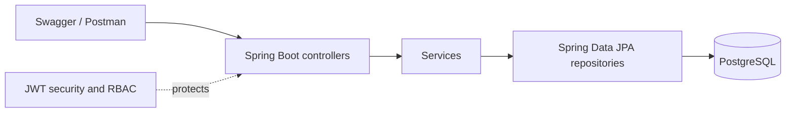

# Planned Architecture

TAMP will use a layered architecture inside one Spring Boot application.

## Controller layer

Controllers will expose versioned REST resources under `/api`, bind request DTOs, trigger Bean Validation, obtain authenticated-user context and return suitable HTTP responses. They will not contain matching or persistence rules.

## Service layer

Services will implement ownership checks, state transitions, matching rules, receipt creation, tracking progression, rating eligibility, dispute handling, metrics and audit-event creation. Transactions will be defined around operations that update related records.

## Repository layer

Spring Data JPA repositories will provide entity persistence and focused queries. Query methods will support ownership filtering, eligible-truck lookup, administrative lists and aggregate counts without leaking database concerns into controllers.

## Database layer

PostgreSQL is the planned development and demonstration database, while the default local and automated-test configuration uses an isolated in-memory H2 database. Spring Data JPA maps the domain entities and relationships, and Hibernate validates them against the migrated schema.

Flyway owns schema changes through versioned files in `src/main/resources/db/migration`. The first migration creates the MVP tables, foreign keys, constraints and indexes. The second migration loads reproducible synthetic seed users and sample records. Applied migrations must not be edited; later schema changes require a new migration.

## Security layer

Spring Security will authenticate JWT bearer tokens and enforce Freight Owner, Transporter and Administrator permissions. Passwords will be hashed with BCrypt. Authentication failures and insufficient permissions will return consistent 401 and 403 responses.

## DTO and validation approach

Request and response DTOs will keep API contracts separate from entities. Bean Validation will cover required text, positive measurements, valid rating ranges and date-window rules. Services will enforce ownership, compatibility and valid transitions.

## Global exception handling

A `@RestControllerAdvice` is planned to map validation failures, missing records, conflicts, forbidden operations and invalid state transitions to a consistent structured error response. Its final schema will be documented after scaffolding.

## Audit logging approach

Important actions will create persisted `AuditEvent` records containing actor, action, entity type, entity identifier, timestamp and limited metadata. Planned audited actions include registration, compliance decisions, posting changes, matching, acceptance, rejection, tracking changes and disputes. Secrets and full sensitive request bodies will not be logged.

## Planned domain objects

- `User`
- `ComplianceDocument`
- `Load`
- `Truck`
- `Match`
- `Receipt`
- `TrackingEvent`
- `Rating`
- `Dispute`
- `AuditEvent`
